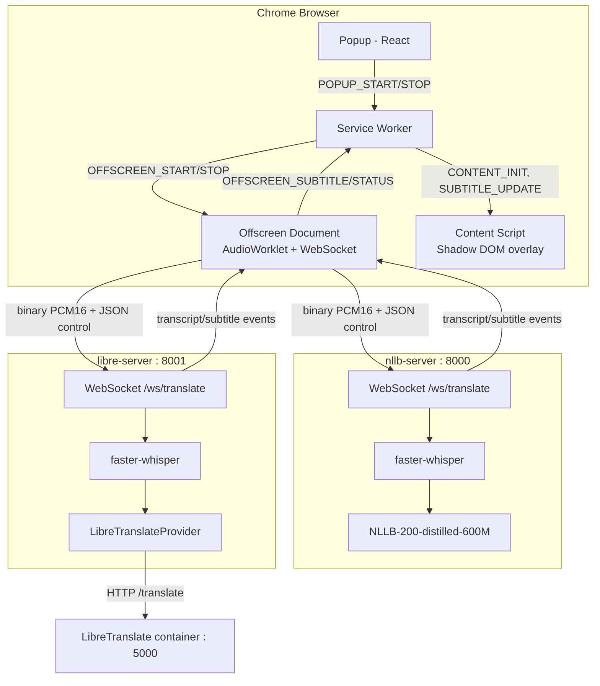
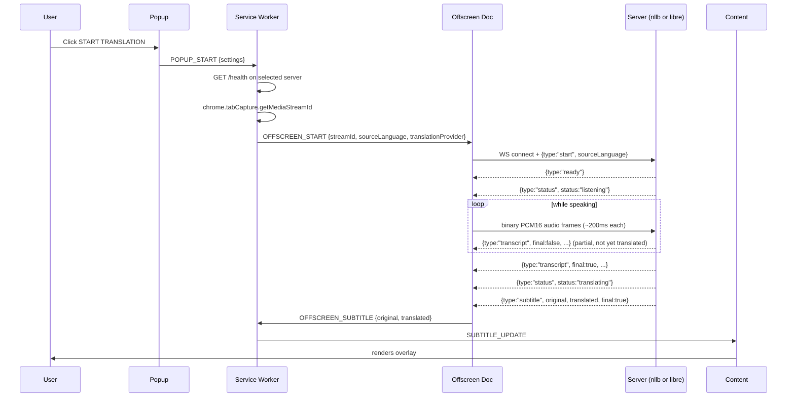

# System Architecture

## System Overview

Three independently runnable pieces, none of which is a compile-time dependency of the others:

1. **extension** — a Chrome Manifest V3 extension (React + TypeScript + Vite) that captures tab audio and renders subtitles.
2. **nllb-server** — a local FastAPI server on port 8000: `faster-whisper` STT + in-process NLLB-200 translation.
3. **libre-server** — a local FastAPI server on port 8001: the same `faster-whisper` STT code, but translates via HTTP calls to a separate, self-hosted LibreTranslate container.

The extension connects to exactly one server per session, chosen by the user's "Translation Engine" popup setting. Both servers implement the identical WebSocket protocol, so the extension's client code is backend-agnostic.

## Architecture Diagram

## Component Descriptions

### extension / background/service-worker.ts
- **Purpose**: Orchestration only — no audio or binary data touches this layer.
- **Responsibilities**: Local-server health check before starting, active-tab validation, offscreen-document lifecycle, relaying subtitle/status messages between the offscreen document and content script, cleanup on tab close/navigation.
- **Dependencies**: `chrome.tabs`, `chrome.scripting`, `chrome.offscreen` APIs; `src/constants/SERVER_CONFIG` for per-engine URLs.
- **Type**: Application (MV3 service worker).

### extension / offscreen/audio-capture.ts + pcm-processor.worklet.ts
- **Purpose**: The only place in the extension that touches real audio.
- **Responsibilities**: `getUserMedia` against the tab's captured stream, routing audio back to `AudioContext.destination` (so the user keeps hearing it), resampling to 16kHz mono PCM16 via an `AudioWorklet`, batching into ~200ms frames, WebSocket transport to whichever server is selected, re-connecting the subtitle overlay across fullscreen transitions.
- **Type**: Application (MV3 offscreen document — required because service workers cannot access `getUserMedia`/`AudioContext`).

### extension / content/content-script.ts
- **Purpose**: On-page subtitle rendering, isolated from host-page CSS.
- **Responsibilities**: Shadow DOM overlay creation, applying display-mode/position/font-size settings, keeping the overlay visible through native fullscreen video by re-parenting into `document.fullscreenElement` on `fullscreenchange`.
- **Type**: Application (classic, non-module script — required by `chrome.scripting.executeScript`).

### nllb-server / app/providers/speech_to_text/faster_whisper.py
- **Purpose**: Streaming STT.
- **Responsibilities**: Sliding-window buffering, VAD-based/multi-segment/max-duration segment finalization, word-timestamp-based safe mid-word-cut avoidance, repetition-loop guard (`no_repeat_ngram_size`), hallucination filtering (`no_speech_prob` threshold).
- **Dependencies**: `faster-whisper` (CTranslate2 Whisper).
- **Type**: Provider implementation (identical file exists in libre-server).

### nllb-server / app/providers/translation/nllb.py
- **Purpose**: Sentence-level NMT translation to Vietnamese.
- **Responsibilities**: Sentence-splitting (to avoid NLLB's multi-sentence truncation bug), technical-term protection/restoration, int8-quantized CPU inference.
- **Dependencies**: `transformers`, `torch`, `facebook/nllb-200-distilled-600M`.
- **Type**: Provider implementation (nllb-server only).

### libre-server / app/providers/translation/libretranslate.py
- **Purpose**: Translation via a self-hosted LibreTranslate HTTP API, same technical-term protection as NLLB's provider.
- **Dependencies**: `httpx` (async HTTP client), a running LibreTranslate container.
- **Type**: Provider implementation (libre-server only).

### Both servers / app/websocket/translation_socket.py
- **Purpose**: WebSocket session handler — the glue between STT and translation.
- **Responsibilities**: Parse `start`/`stop` control messages, feed binary audio into the STT provider, translate finalized segments, stream `transcript`/`subtitle`/`status`/`error` events back, per-session stats/logging.
- **Type**: Duplicated between the two servers by deliberate choice (see Dependencies doc) — manual sync on change, not a shared package.

## Data Flow

## Integration Points

- **External APIs**: None in normal operation — the entire point of this project is that audio/transcripts never leave localhost. The only network access is (a) one-time model downloads from Hugging Face on first run, and (b) `libre-server` talking to its own local LibreTranslate container.
- **Databases**: None. No persistence layer exists; settings live in `chrome.storage.local` (browser-side only).
- **Third-party Services**: `libretranslate/libretranslate` Docker image (self-hosted, not a hosted API).

## Infrastructure Components

- **Docker**: Each server has its own `Dockerfile`. `libre-server` additionally has a `docker-compose.yml` that brings up the app container plus a `libretranslate/libretranslate` container together, since translation there requires a second running process.
- **Deployment Model**: Fully local — every component runs on the developer's/user's own machine. No cloud deployment target exists.
- **Networking**: Everything communicates over `127.0.0.1` — `extension` → `nllb-server:8000` or `libre-server:8001`; `libre-server` → LibreTranslate engine on `:5000` (or `libretranslate:5000` inside the Compose network).
