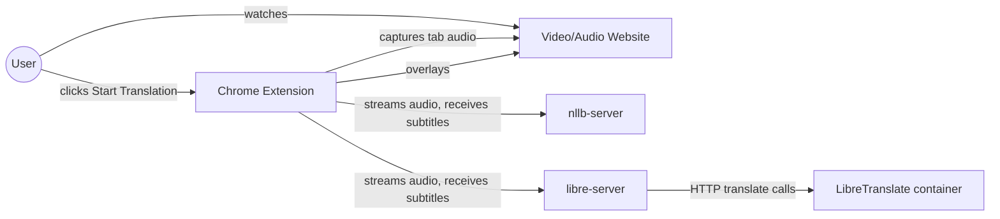

# Business Overview

## Business Context Diagram

## Business Description

- **Business Description**: A privacy-first Chrome extension that generates near-real-time Vietnamese subtitles for whatever audio/video is playing in the current browser tab. Speech-to-text and translation both run on the user's own machine — no paid cloud AI APIs, no audio or transcript ever leaves localhost during normal operation.
- **Business Transactions**:
  - **Start Translation Session** — user selects a source language and translation engine, clicks Start; the extension captures tab audio, streams it to a local server, and begins overlaying translated subtitles while the original audio keeps playing normally.
  - **Stop Translation Session** — user clicks Stop; all capture/audio/WebSocket resources are released and the subtitle overlay is removed.
  - **Local Server Health Check** — before starting a session, the extension verifies the selected backend server is running and its models are ready, showing a clear error instead of failing silently.
  - **Select Translation Engine** — user chooses NLLB or LibreTranslate as the translation backend for the session; the choice determines which of the two independent local servers the extension connects to.
- **Business Dictionary**:
  - **Source Language** — the spoken language in the tab audio; one of `en` (English), `ja` (Japanese), `zh` (Chinese). Manually selected, never auto-detected.
  - **Target Language** — always Vietnamese (`vi`); this is not configurable.
  - **Segment** — one finalized unit of speech (roughly a sentence or clause) that gets transcribed and translated as a whole.
  - **Partial / Final Transcript** — a partial transcript is an in-progress, not-yet-finalized recognition of the current segment; a final transcript is settled and gets translated.
  - **Translation Provider** — which translation backend produced a subtitle: `nllb` or `libretranslate`.
  - **Subtitle Overlay** — the fixed-position, Shadow-DOM-isolated element the extension injects into the page to display translated (and optionally original) text.
  - **Display Mode** — `vietnamese` (translation only) or `bilingual` (original + translation).

## Component Level Business Descriptions

### extension
- **Purpose**: The user-facing Chrome extension — captures tab audio, presents settings, renders the subtitle overlay.
- **Responsibilities**: Tab audio capture without interrupting playback, audio resampling/streaming, popup settings UI, on-page subtitle rendering, orchestration/error-handling across its own internal components.

### nllb-server
- **Purpose**: Default local backend — converts captured audio to Vietnamese subtitles using `faster-whisper` for speech recognition and `facebook/nllb-200-distilled-600M` for translation, both running in-process.
- **Responsibilities**: Load and serve the STT/translation models once at startup, stream transcript/subtitle events back over WebSocket, protect known technical terms from mistranslation.

### libre-server
- **Purpose**: Alternative local backend, same STT pipeline as nllb-server but translates via a self-hosted **LibreTranslate** container over HTTP instead of an in-process NLLB model.
- **Responsibilities**: Same STT responsibilities as nllb-server; additionally proxies translation requests to a separate LibreTranslate container and reports its live reachability via `/health`.

## Why two translation backends

Measured directly during development (not assumed): NLLB is more reliable on Japanese and on preserving technical terms; LibreTranslate is noticeably better at casual English register, slang, and profanity (e.g. "Damn" translates correctly vs. NLLB producing nonsense). Neither is a strict upgrade over the other, so both are kept as a user-facing choice rather than picking one.
