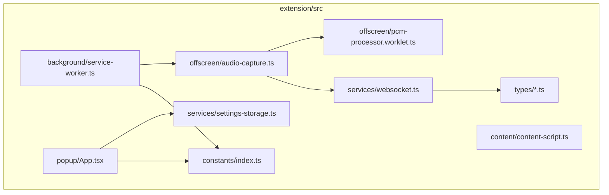
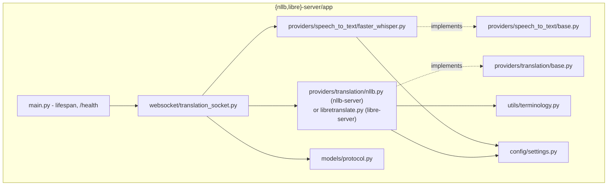

# Code Structure

## Build System

- **extension**: `npm` + `vite` (with `@crxjs/vite-plugin` for MV3 bundling). `npm run build` → `tsc -b && vite build`; `npm run lint` → `oxlint` (config: `extension/.oxlintrc.json`).
- **nllb-server / libre-server**: `pip` + a Python venv (developed against pyenv's 3.9.25), or Docker (`Dockerfile` per server, plus `docker-compose.yml` in libre-server for the two-container case). No build step — plain Python.

## Key Modules / Module Hierarchy

## Existing Files Inventory

### extension/src
- `background/service-worker.ts` — orchestration: health checks, offscreen-doc lifecycle, tab lifecycle listeners, message routing.
- `offscreen/audio-capture.ts` — tab-audio capture, AudioWorklet wiring, WebSocket session lifecycle.
- `offscreen/pcm-processor.worklet.ts` — AudioWorkletProcessor: downmix + resample to 16kHz mono, batches ~200ms PCM16 frames.
- `offscreen/offscreen.html` — host page for the offscreen document.
- `content/content-script.ts` — Shadow DOM subtitle overlay, fullscreen re-parenting.
- `popup/App.tsx` — settings UI (source language, translation engine, display mode, text size, position) + start/stop control + status display.
- `popup/popup.css` — popup visual styling (dark/amber theme).
- `popup/index.html`, `popup/main.tsx` — popup entry point.
- `services/websocket.ts` — thin `TranslationSocket` wrapper around the browser `WebSocket` API, typed to the protocol.
- `services/settings-storage.ts` — `chrome.storage.local` read/write for `UserSettings`.
- `types/protocol.ts` — WebSocket message types, mirrors server `models/protocol.py`.
- `types/messages.ts` — internal extension-to-extension runtime message types (popup ↔ service worker ↔ offscreen ↔ content script).
- `types/settings.ts` — `UserSettings` shape + defaults.
- `types/audio-worklet.d.ts` — ambient types for the `AudioWorklet` API surface TypeScript doesn't ship by default.
- `constants/index.ts` — `SERVER_CONFIG` (per-engine origin/health/WS URLs), extension-internal path constants.
- `utils/timeout.ts` — `withTimeout()` helper used to bound the offscreen-doc startup round-trip.
- `manifest.json` — MV3 manifest (permissions, host_permissions for both server ports).
- `vite.config.ts` — crxjs plugin + explicit `rollupOptions` for entries the manifest doesn't declare directly (offscreen.html, the worklet, the content script).

### {nllb,libre}-server/app
- `main.py` — FastAPI app, `lifespan()` loading models/providers once at startup, `/health` endpoint.
- `websocket/translation_socket.py` — the `/ws/translate` handler: parses control messages, drives the STT provider, translates finalized segments, streams events back.
- `providers/speech_to_text/base.py` — `SpeechToTextProvider` ABC + `TranscriptResult` dataclass.
- `providers/speech_to_text/faster_whisper.py` — the streaming STT implementation (identical file in both servers).
- `providers/translation/base.py` — `TranslationProvider` ABC.
- `providers/translation/nllb.py` (nllb-server only) — NLLB provider.
- `providers/translation/libretranslate.py` (libre-server only) — LibreTranslate HTTP-client provider.
- `utils/terminology.py` — `protect_terms`/`restore_terms` placeholder substitution, shared by both translation providers.
- `models/protocol.py` — Pydantic models for the WebSocket protocol, mirrors extension `types/protocol.ts`.
- `config/settings.py` — every tunable constant (Whisper windowing/finalization, translation backend URLs, audio format), all env-var overridable.
- `Dockerfile`, `requirements.txt`, `run-server.bat`, `README.md` — per-server deployment/docs.
- `docker-compose.yml` (libre-server only) — bundles the app container with a `libretranslate/libretranslate` engine container.

## Design Patterns

### Provider Abstraction
- **Location**: `providers/speech_to_text/base.py`, `providers/translation/base.py`.
- **Purpose**: Decouple the WebSocket handler from a specific STT/translation implementation, so a backend can be swapped without touching session logic. Proven out for real: `libre-server` is a second, independent `TranslationProvider` implementation added without changing the abstraction.
- **Implementation**: Python `ABC`s with `async` methods; concrete classes (`FasterWhisperProvider`, `NLLBTranslationProvider`, `LibreTranslateProvider`) implement them.

### Shadow DOM Isolation
- **Location**: `extension/src/content/content-script.ts`.
- **Purpose**: Prevent the injected subtitle overlay from being affected by (or affecting) the host page's CSS.
- **Implementation**: A single host `
` with `attachShadow({mode:"open"})`; all overlay markup/styles live inside the shadow root.

### Offscreen Document (MV3 audio access)
- **Location**: `extension/src/offscreen/`.
- **Purpose**: Service workers cannot use `getUserMedia`/`AudioContext`; MV3 requires an offscreen document for any real media processing.
- **Implementation**: `chrome.offscreen.createDocument()` invoked lazily by the service worker; all audio capture/WebSocket logic lives there instead.

### Sliding-Window Streaming STT
- **Location**: `faster_whisper.py`.
- **Purpose**: Near-real-time transcription without re-processing unbounded audio history.
- **Implementation**: Accumulate audio in a buffer, periodically re-transcribe, use VAD/multi-segment/max-duration signals to finalize and trim the buffer. (Currently re-transcribes the whole unbounded-until-finalized buffer rather than a fixed window — see `segment-improvement.md` for a proposed refactor.)

### Terminology Protection
- **Location**: `utils/terminology.py`.
- **Purpose**: Prevent NMT models from mistranslating technical product/library names (React, Docker, API, etc.).
- **Implementation**: Regex-based placeholder substitution before translation, restoration after — provider-agnostic, used by both `nllb.py` and `libretranslate.py`.

## Critical Dependencies

### faster-whisper (>=1.2,<1.3)
- **Usage**: Speech-to-text in both servers, via `WhisperModel`. Ships its own bundled Silero VAD (used internally via `vad_filter=True`).
- **Purpose**: CPU-friendly (int8), CTranslate2-based Whisper inference — chosen over vanilla `openai-whisper` for CPU performance.

### transformers + torch (nllb-server only)
- **Usage**: Loads and runs `facebook/nllb-200-distilled-600M`; dynamic int8 quantization applied on CPU (`torch.quantization.quantize_dynamic`) for ~2.5x speedup.
- **Purpose**: In-process NMT translation.

### httpx (libre-server only)
- **Usage**: Async HTTP client for calling the LibreTranslate container's `/translate` and `/languages` endpoints.
- **Purpose**: Translation-over-HTTP instead of an in-process model.

### React 19 + Vite 8 + @crxjs/vite-plugin (extension)
- **Usage**: Popup UI (React); MV3-aware bundling for a multi-entry-point extension (service worker, offscreen doc, content script, popup) via crxjs.
- **Purpose**: Modern build tooling for a Manifest V3 extension; crxjs specifically handles MV3's non-standard entry-point requirements that plain Vite doesn't.
