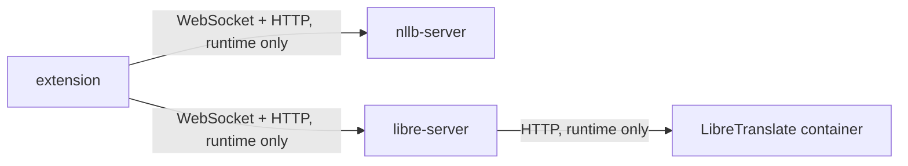

# Dependencies

## Internal Dependencies

There are **no compile-time or import-level dependencies** between the three packages — `extension` never imports server code and vice versa; the relationship is purely "connects to over the network at runtime." `nllb-server` and `libre-server` do not depend on each other at all, at runtime or otherwise; a user can run either one alone.

### extension depends on nllb-server or libre-server
- **Type**: Runtime (WebSocket for streaming, HTTP for health checks).
- **Reason**: The extension has no built-in STT/translation capability — it's purely a capture/UI/overlay client. Exactly one of the two is required to be running for the extension to do anything useful.

### libre-server depends on a LibreTranslate container
- **Type**: Runtime (HTTP).
- **Reason**: `libre-server` doesn't run a translation model itself — it proxies to a separately-running `libretranslate/libretranslate` container. Without it, `libre-server`'s `/health` reports `translationReady: false` and the popup disables that engine option.

### nllb-server and libre-server share no code package
- **Type**: N/A — this is a deliberate *non*-dependency.
- **Reason**: `faster_whisper.py`, `translation_socket.py`, `terminology.py`, and `protocol.py` are duplicated file-for-file between the two server folders rather than factored into a shared package. This was an explicit tradeoff made when the two-server split was introduced: manual sync on change (already exercised once — a repetition-loop fix had to be hand-applied to both copies) was accepted in exchange for two fully independent, simple deployments instead of a shared-package build/versioning story. See `segment-improvement.md` for the open question of whether to revisit this before the next round of pipeline changes.

## External Dependencies

### extension

| Dependency | Version | Purpose | License |
|---|---|---|---|
| react, react-dom | ^19.2.8 | Popup UI | MIT |
| vite | ^8.2.2 | Build tool | MIT |
| @crxjs/vite-plugin | ^2.7.1 | MV3-aware bundling | MIT |
| typescript | ~6.0.2 | Type checking/build | Apache-2.0 |
| oxlint | ^1.79.0 | Linting | MIT |
| @types/chrome, @types/react, @types/react-dom, @types/node | various | Type definitions only | MIT |

### nllb-server

| Dependency | Version | Purpose | License |
|---|---|---|---|
| fastapi | >=0.115,<0.116 | HTTP/WebSocket framework | MIT |
| uvicorn[standard] | >=0.32,<0.33 | ASGI server | BSD-3-Clause |
| faster-whisper | >=1.2,<1.3 | Speech-to-text | MIT |
| numpy | >=2.0,<3.0 | Audio array conversion | BSD-3-Clause |
| transformers | >=4.57,<4.58 | Loads/runs NLLB | Apache-2.0 |
| sentencepiece | >=0.2,<0.3 | NLLB tokenizer dependency | Apache-2.0 |
| torch (CPU wheel) | unpinned, from PyTorch's CPU index | NLLB inference | BSD-3-Clause |

### libre-server

| Dependency | Version | Purpose | License |
|---|---|---|---|
| fastapi | >=0.115,<0.116 | HTTP/WebSocket framework | MIT |
| uvicorn[standard] | >=0.32,<0.33 | ASGI server | BSD-3-Clause |
| faster-whisper | >=1.2,<1.3 | Speech-to-text | MIT |
| numpy | >=2.0,<3.0 | Audio array conversion | BSD-3-Clause |
| httpx | >=0.27,<0.28 | Async HTTP client to LibreTranslate | BSD-3-Clause |

### External containers/models (not pip/npm dependencies)

| Name | Purpose | Notes |
|---|---|---|
| facebook/nllb-200-distilled-600M | Translation (nllb-server) | Downloaded from Hugging Face on first run (~2.4GB), cached locally afterward. |
| faster-whisper `base` model | Speech recognition (both servers) | Downloaded on first run, cached locally. |
| libretranslate/libretranslate (Docker image) | Translation engine (libre-server) | Argos-Translate-based; run as its own container, not a pip dependency. |
